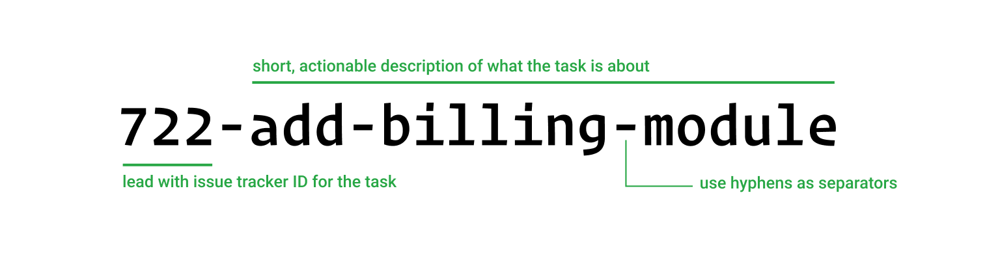
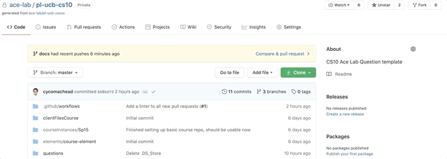
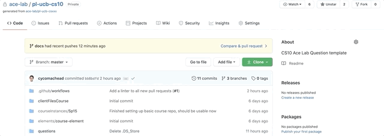

# Contributing to PL-UCB-CS10

Hello 👋, thanks for contributing to the development of CS10 PrairieLearn (PL) course repository

## Table of Contents

- [Contributing to PL-UCB-CS10](#contributing-to-pl-ucb-cs10)
  - [Table of Contents](#table-of-contents)
  - [How to Contribute](#how-to-contribute)
    - [Branching](#branching)
      - [Commit Messages](#commit-messages)
    - [Issue Reporting](#issue-reporting)
    - [Pull Request (PR)](#pull-request-pr)
    - [Merge Pull Request (PR)](#merge-pull-request-pr)
  - [Problems and Concerns](#problems-and-concerns)

## How to Contribute

Make sure you have read through the [README.md](README.md) and have setup a running version of the course instance on PL on your own machine.

To contribute to this repository, we are going to take advantage of Github's built-in collaboration features for Issue Tracking and repo modifications.

### Branching

During development, please create dedicated branches for specific features. For example, if you're working on a problem called "Matrix Multiplication", create a new branch called `matrix-multiplication`, and develop your code on that branch.

Don't worry too much about the tracker ID in the above example.

*Note:* there is no need to fork the course repo since it is private, just create a new branch any time you need it.

[Here](https://github.com/Kunena/Kunena-Forum/wiki/Create-a-new-branch-with-git-and-manage-branches) is a guide on branch workflow

Some key steps you should keep in mind:

- Update the repo before creating a new branch, preferably from `origin master`.
- Check you're on the correct branch before you start coding.
- Proactively update your branch with `origin master` during development process and resolve conflicts.
- Update your branch with `origin master` + resolve conflicts before creating a new [Pull Request (PR)](#pull-request-pr)

#### Commit Messages

As good practice, it is highly recommended that you provide meaningful, but succinct commit messages every time you do a commit.

[Here](https://github.com/erlang/otp/wiki/writing-good-commit-messages) is a short guide on writing these message.

### Issue Reporting

If you would like to propose change(s) to the repo, but let other people do the work, for example, a bug report, or additional problem set request, etc. Please feel free to file an issue in the repo.

Below points outline steps to file a Issue:

- Navigate to Issues Tab: [direct link](https://github.com/ace-lab/pl-ucb-cs10/issues)
- Click `New issue`
- Fill in Title and Comment of the issue.
  - The Title should be a succinct summary of what the issue is about
  - The Comment should be a detailed description of the issue itself, please be precise
- Optionally
  - Assign the Issue to a member of the team, it is okay to leave it blank or simply assign it to the relevant lead related to the Issue.
  - Select a label for the Issue, for example, is it an enhancement or a bug?
  - Select Project and/or Milestone related to the Issue as you see fit.
- Once you're done, click `Submit new issue` button to formally submit the Issue.

Below is a quick animation of the steps outlined above

### Pull Request (PR)

If you would like to propose change(s) to the repo, and you already have *working code* on a feature branch, for example, a new question, or changes to any existing code etc.

Below points outline steps to create a PR:

- Navigate to `Pull requests` tab: [direct link](https://github.com/ace-lab/pl-ucb-cs10/pulls)
- Click `New pull request`
  - Github might give you a short cut `Compare & pull request` if you recently pushed to your branch; it's the same thing.
- Select the branch you want to merge to `master`.
- Fill in the Title and Comment with meaningful description of what the PR is about.
- As long as there is no conflict, select `Create pull request`.
  - There shouldn't be any conflict as long as you've updated your branch to `master` locally and have resolved conflicts there; refer to [Branching](#branching).
- After you've created a PR, you have the options to select attributes of your PR, follow same convention as outlined in [Issue Reporting](#issue-reporting).

Below is a quick animation of the steps outlined above

### Merge Pull Request (PR)

Read this before you merge a PR!

When merging a PR, please select `Squash and merge` in the dropdown menu of `Merge pull request`. What `Squash` does is that it combines all commits associated with the PR into a single commit. This will reduce number of commits on the `master` branch, and will be easier to reset `master` if the need arises.

Don't merge the PR if it doesn't pass the Continuous Integration (CI) Tests; instead, fix it first!

Once merged, might need to ask the person submitting the PR if the branch can be deleted.

## Problems and Concerns

Please feel free to ask questions on team communication channels.
