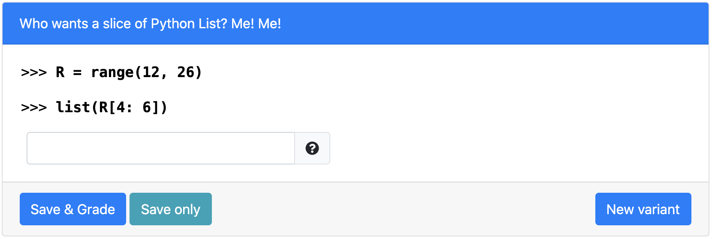

# Who wants a slice of Python List? Me! Me!! 
> Tests for skills on list slicing (Fill In The Blank Version) 

## Table of Contents
- [Variants](#variants)
- [Notes](#Notes)
- [Structure](#structure)
- [How to run on PrairieLearn](#how-to-run-on-prairielearn)
- [Contact](#Contact)
​
## Variants
- The starting number of R ranges in [0, 100]
- The ending number of R ranges in [s + 10, s + 20], where s is the starting number of R
- The starting query index ranges in [2, 4]
- The ending query index ranges in [si + 2, si + 4], where si is the starting query index

## Notes
The question checks if the student knows what the correct output list is. Therefore, any redundant or lacking white spaces in the students solution will be ignored. The solution will be given full score as long as other parts are corrected. 

## Structure
> Names of directories and files (except for png files) a required to remain the same for PL to read
​
- [**info.json**](info.json)
  - "Title" is the name displayed on the blue [line](#part-1)
  - "Topic" is based on course [concept map](https://docs.google.com/document/d/1B4QBVE2CvoQNXok986j8sVsMYb9662Nd8bFI9nIIj4g/edit) (access required)
  - For tag descriptions, see infoCourse.json in main course directory
​
- [**question.html**](question.html)
  - Question panel element (question text) documentation [documentation](https://prairielearn.readthedocs.io/en/latest/elements/#pl-question-panel-element)
  - String Input Element documentation [documentation](https://prairielearn.readthedocs.io/en/latest/elements/#pl-string-input-element)
​
- [**server.py**](server.py)
  - Question generator file, with all of the randomization components.
  - Make changes here if adding or deleting variants to clientFilesQuestion
​
- [**serverFilesQuestion**](serverFilesQuestion)
  - Examples for README.md and solutions (explains the logic for solving)
  - Not available to students

## How to run on PrairieLearn
1. Pull course onto local desktop
2. Open local host, follow instructions on [PrairieLearn](https://prairielearn.readthedocs.io/en/latest/installing/) or on the main directory's README.md file.
3. Load from disk, click PrairieLearn, and select CS10
4. Under "Questions" button at the top, select "predicate_mystery_replace" under QUID
5. Click "New variant" to see the other variants 
NOTE: If changes to any .json file is made, Load from disk again
​

## Contact

Contact via liaoqitian1024@gmail.com or find Qitian Liao on Slack channel. 