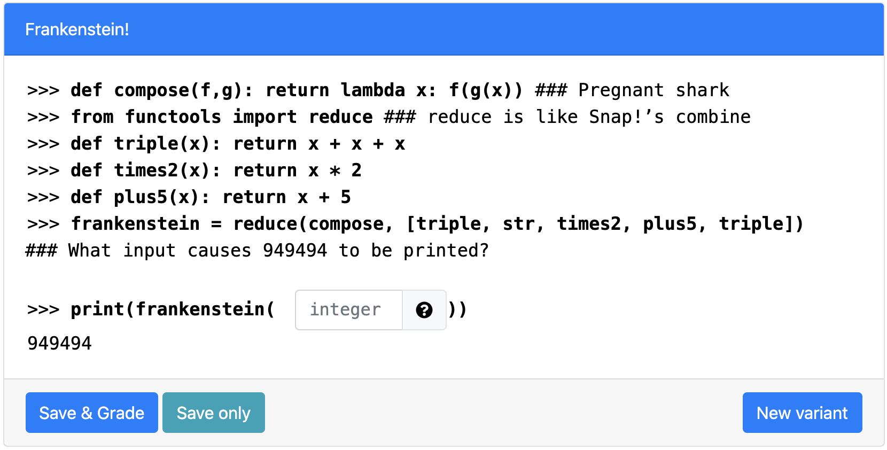

# Frankenstein!
> Tests for skills on Lambda Functions and list operations (Fill In The Blank Version) 

## Table of Contents
- [Variants](#variants)
- [Notes](#notes)
- [Structure](#structure)
- [How to run on PrairieLearn](#how-to-run-on-prairielearn)
- [Contact](#Contact)
​

## Variants
> 1v132
- The resulting function call looks like: **reduce(compose, [function_one, str, function_two, function_three, function_one])**  
- **function_one** and **function_two** are always paired. The two possible pairs are **[double, times3]** and **[triple, times2]**
- **function_three** is a "**plus**" function, randomly chosen from **plus1**, **plus4** and **plus5**.

## Notes
The output is provided and the student is asked to give the corresponding input. This is relatively harder than if the information given is swapped. For the plus function, the parameters 4 and 5 are intentionally chosen to avoid confusion with parameters in the other two functions. 

## Structure
> Names of directories and files (except for png files) a required to remain the same for PL to read
​
- [**info.json**](info.json)
  - "Title" is the name displayed on the blue [line](#part-1)
  - "Topic" is based on course [concept map](https://docs.google.com/document/d/1B4QBVE2CvoQNXok986j8sVsMYb9662Nd8bFI9nIIj4g/edit) (access required)
  - For tag descriptions, see infoCourse.json in main course directory
​
- [**question.html**](question.html)
  - Question panel element (question text) documentation [documentation](https://prairielearn.readthedocs.io/en/latest/elements/#pl-question-panel-element)
  - Integer Input Element documentation [documentation](https://prairielearn.readthedocs.io/en/latest/elements/#pl-integer-input-element)
​
- [**server.py**](server.py)
  - Question generator file, with all of the randomization components.
  - Make changes here if adding or deleting variants to clientFilesQuestion
​
- [**serverFilesQuestion**](serverFilesQuestion)
  - Examples for README.md and solutions (explains the logic for solving)
  - Not available to students

## How to run on PrairieLearn
1. Pull course onto local desktop
2. Open local host, follow instructions on [PrairieLearn](https://prairielearn.readthedocs.io/en/latest/installing/) or on the main directory's README.md file.
3. Load from disk, click PrairieLearn, and select CS10
4. Under "Questions" button at the top, select "predicate_mystery_replace" under QUID
5. Click "New variant" to see the other variants 
NOTE: If changes to any .json file is made, Load from disk again
​

## Contact
Contact via liaoqitian1024@gmail.com or find Qitian Liao on Slack channel. 
