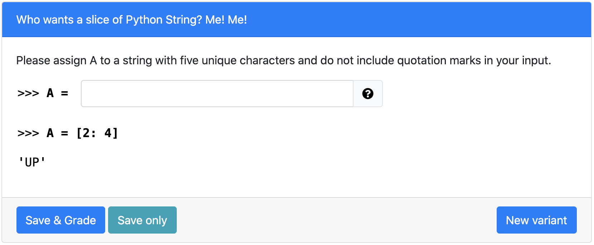

# Who wants a slice of Python String? Me! Me!
> Tests for skills on string slicing (Fill In The Blank Version) 

## Table of Contents
- [Variants](#variants)
- [Notes](#notes)
- [Structure](#structure)
- [How to run on PrairieLearn](#how-to-run-on-prairielearn)
- [Contact](#Contact)
​

## Variants
- The starting index ranges in [1, 3]
- The ending index is two plus the starting index 

## Notes
The student is expected to input a string of five unique characters. If there are repeated characters or the student's solution has fewer or more than five characters, an "invalid warning" would be thrown. The warning would specify the first character which is repeated if there is any. 

## Structure
> Names of directories and files (except for png files) a required to remain the same for PL to read
​
- [**info.json**](info.json)
  - "Title" is the name displayed on the blue [line](#part-1)
  - "Topic" is based on course [concept map](https://docs.google.com/document/d/1B4QBVE2CvoQNXok986j8sVsMYb9662Nd8bFI9nIIj4g/edit) (access required)
  - For tag descriptions, see infoCourse.json in main course directory
​
- [**question.html**](question.html)
  - Question panel element (question text) documentation [documentation](https://prairielearn.readthedocs.io/en/latest/elements/#pl-question-panel-element)
  - String Input Element documentation [documentation](https://prairielearn.readthedocs.io/en/latest/elements/#pl-string-input-element)
​
- [**server.py**](server.py)
  - Question generator file, with all of the randomization components.
  - Make changes here if adding or deleting variants to clientFilesQuestion
​
- [**serverFilesQuestion**](serverFilesQuestion)
  - Examples for README.md and solutions (explains the logic for solving)
  - Not available to students

## How to run on PrairieLearn
1. Pull course onto local desktop
2. Open local host, follow instructions on [PrairieLearn](https://prairielearn.readthedocs.io/en/latest/installing/) or on the main directory's README.md file.
3. Load from disk, click PrairieLearn, and select CS10
4. Under "Questions" button at the top, select "predicate_mystery_replace" under QUID
5. Click "New variant" to see the other variants 
NOTE: If changes to any .json file is made, Load from disk again
​
## Contact
Contact via liaoqitian1024@gmail.com or find Qitian Liao on Slack channel. 
