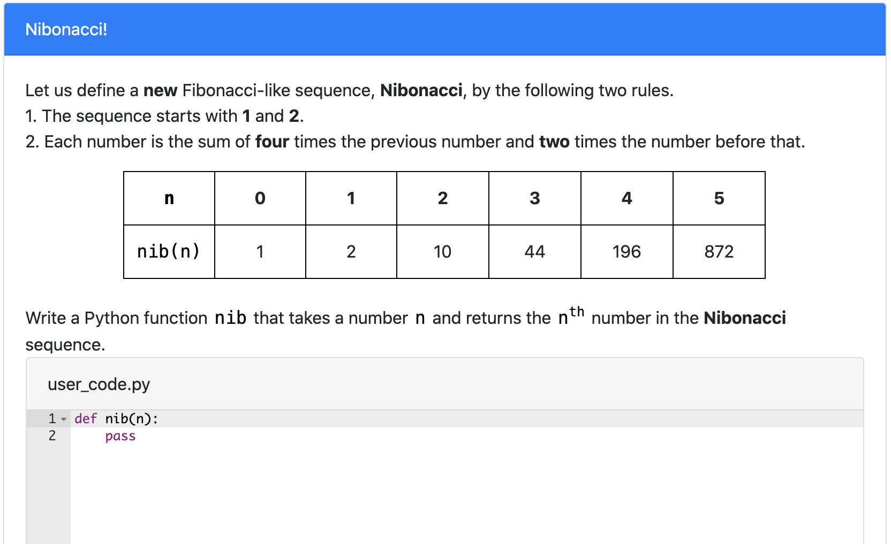

# Nibonacci Family
> Similar but different to the widely-known Fibonacci sequence, this question tests for skills on recursion and string slicing on slightly more difficult sequences. 
## Table of Contents
- [Variants](#variants)
- [Structure](#structure)
- [How to run on PrairieLearn](#how-to-run-on-prairielearn)
- [Contact](#Contact)
​
## Variants
- The first number ranges from [-1, 1] 
- The second number ranges from [1, 3]
- The two mulitipliers range from [1, 4] and are unique to one another
- For each consecutive pairs, multiplier_one * number_one + multiplier_two * number_two = number_three

​

## Structure
> Names of directories and files (except for png files) a required to remain the same for PL to read
​
- [**info.json**](info.json)
  - "Title" is the name displayed on the blue [line](#part-1)
  - "Topic" is based on course [concept map](https://docs.google.com/document/d/1B4QBVE2CvoQNXok986j8sVsMYb9662Nd8bFI9nIIj4g/edit) (access required)
  - For tag descriptions, see infoCourse.json in main course directory
​
- [**question.html**](question.html)
  - Question panel element (question text) documentation [documentation](https://prairielearn.readthedocs.io/en/latest/elements/#pl-question-panel-element)
  - This Question contains dead python: File editor element documentation [documentation](https://prairielearn.readthedocs.io/en/latest/elements/#pl-file-editor-element)
​
- [**server.py**](server.py)
  - Question generator file, with all of the randomization components.
  - Make changes here if adding or deleting variants to clientFilesQuestion
​
- [**serverFilesQuestion**](serverFilesQuestion)
  - Examples for README.md and solutions (explains the logic for solving)
  - Not available to students

## How to run on PrairieLearn
1. Pull course onto local desktop
2. Open local host, follow instructions on [PrairieLearn](https://prairielearn.readthedocs.io/en/latest/installing/) or on the main directory's README.md file.
3. Load from disk, click PrairieLearn, and select CS10
4. Under "Questions" button at the top, select "predicate_mystery_replace" under QUID
5. Click "New variant" to see the other variants 
NOTE: If changes to any .json file is made, Load from disk again
​

## Contact

Contact via liaoqitian1024@gmail.com or find Qitian Liao on Slack channel. 
