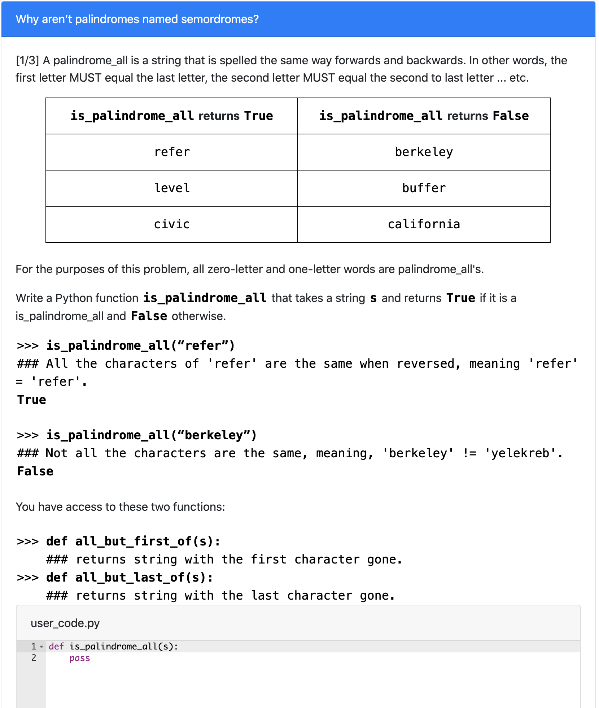
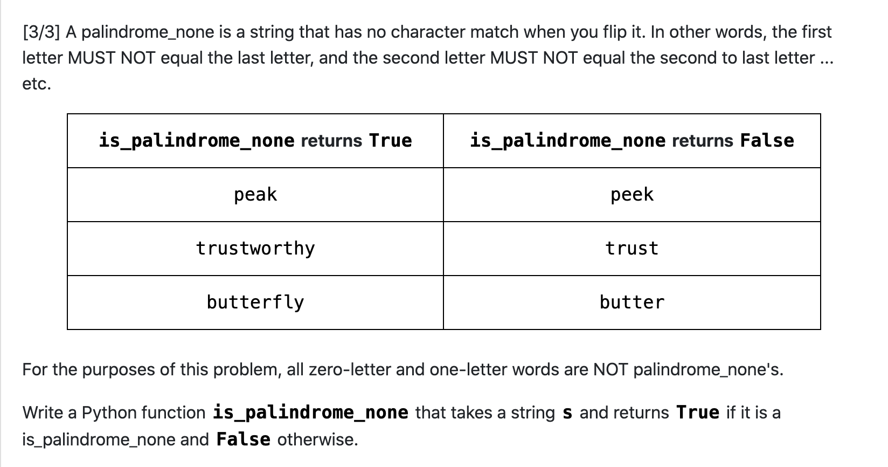

# Palindrome Family
> Tests for skills on recursion and string slicing 
## Table of Contents
- [Palindrome Family](#Palindrome-Family)
  - [Table of Contents](#table-of-contents)
  - [Variant](#examples)
    - [Palindrome_All](#Palindrome_All)
    - [Palindrome_Any](#Palindrome_Any)
    - [Palindrome_None](#Palindrome_None)
  - [Structure](#structure)
  - [Solutions](#solutions)
    - [One solution](#one-solution)
    - [Multiple solutions](#multiple-solutions)
      - [Solution 1](#solution-1)
      - [Solution 2](#solution-2)
  - [How to run on PrairieLearn](#how-to-run-on-prairielearn)
  - [Contact](#Contact)
​
## Variants
### Palindrome_All
​
​
### Palindrome_Any
​

​
### Palindrome_None
​

​
## Structure
​
> Namesof directories and files (except for png files) a required to remain the same for PL to read
​
- [**info.json**](info.json)
  - "Title" is the name displayed on the blue [line](#part-1)
  - "Topic" is based on course [concept map](https://docs.google.com/document/d/1B4QBVE2CvoQNXok986j8sVsMYb9662Nd8bFI9nIIj4g/edit) (access required)
  - For tag descriptions, see infoCourse.json in main course directory
​
- [**question.html**](question.html)
  - Question panel element (question text) documentation [documentation](https://prairielearn.readthedocs.io/en/latest/elements/#pl-question-panel-element)
  - This Question contains dead python:
    - File editor element (multiple-select multiple-choice) documentation [documentation](https://prairielearn.readthedocs.io/en/latest/elements/#pl-file-editor-element)
​
- [**server.py**](server.py)
  - Question generator file, with all of the randomization components.
  - Make changes here if adding or deleting variants to clientFilesQuestion
​
- [**serverFilesQuestion**](serverFilesQuestion)
  - Examples for README.md and solutions (explains the logic for solving)
  - Not available to students
  
## Solutions
​
### One solution
​

​

​

​
### Multiple solutions
​
This example has multiple solutions for part 2:
​

​
#### Solution 1
​

​
#### Solution 2
​

​
## How to run on PrairieLearn
​
1. Pull course onto local desktop
2. Open local host, follow instructions on [PrairieLearn](https://prairielearn.readthedocs.io/en/latest/installing/) or on the main directory's README.md file.
3. Load from disk, click PrairieLearn, and select CS10
4. Under "Questions" button at the top, select "predicate_mystery_replace" under QUID
5. Click "New variant" to see more examples
NOTE: If changes to any .json file is made, Load from disk again
​
## Contact

Contact via liaoqitian1024@gmail.com or find Qitian Liao on Slack channel. 
