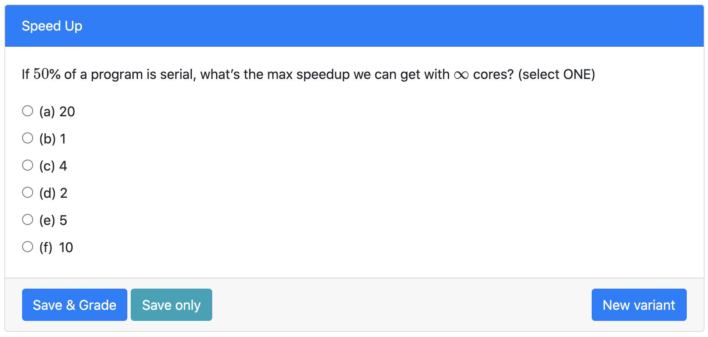

# Speed Up (Spring 2019, Question 5)
> Concurrency

## Table of Contents
- [Sign and Magnitude (Summer 2019, Question 5)](#Sign-and-Magnitude-Summer-2019-Question-5)
  - [Examples](#examples)
  - [Structure](#structure)
  - [Solutions](#solutions)
  - [How to run on PrairieLearn](#how-to-run-on-prairielearn)

## Examples

	
## Structure
> Names of directories and files (except for png files) a required to remain the same for PL to read

* **info.json**
  * "Title" is the name displayed on the blue [line](#examples)
  * "Topic" is based on course concept map (must have access), you can find it [here](https://docs.google.com/document/d/1B4QBVE2CvoQNXok986j8sVsMYb9662Nd8bFI9nIIj4g/edit).
  * For tag descriptions, go to infoCourse.json in main course directory
  
* **question.html**
  * Question panel element (question text) documentation [here](https://prairielearn.readthedocs.io/en/latest/elements/#pl-question-panel-element)
  * Multiple Choice input element documentation [here](https://prairielearn.readthedocs.io/en/latest/elements/#pl-multiple-choice-element)
  
* **server.py**
  * The percentage of program which is serial is randomized in the list [5, 10, 20, 25, 50, 100]. Then the corresponding solution is computed by taking its reciprical.

## Solutions

## How to run on PrairieLearn

1. Pull course onto local desktop
2. Open local host, follow instructions [here](https://prairielearn.readthedocs.io/en/latest/installing/)
3. Load from disk, click PrairieLearn, and select CS10
4. Under "Questions" button at the top, select "Sign and Magnitude" under QUID 
5. Click "New variant" to see more examples
NOTE: If changes to any .json file is made, Load from disk again

**Contact liaoqitian1024@gmail.com or find Qitian Liao on Slack for questions** 
